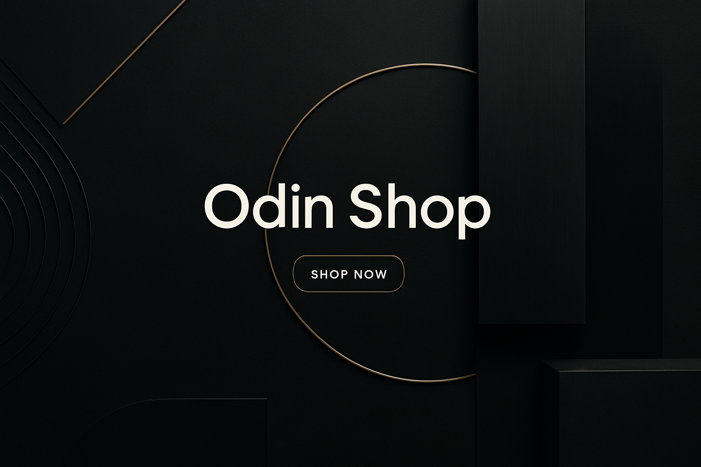

# Odin Shop - React Shopping Cart

A modern e-commerce shopping cart built with React, featuring product browsing, cart functionality, and responsive design. This project was created as part of The Odin Project curriculum to demonstrate React skills and e-commerce functionality implementation.



## 🚀 Features

- **Responsive Design**: Modern UI that works on both desktop and mobile devices
- **Client-Side Routing**: Seamless navigation between pages without reloading
- **Product Display**: Browse products fetched from a RESTful API
- **Shopping Cart**: Add products to cart with quantity selection
- **Cart Modal**: View cart contents with product details and totals
- **Dynamic Updates**: Cart count updates in real-time in the navigation bar

## 🛠️ Technologies Used

- **React 19**: Core UI library
- **React Router**: Client-side routing
- **CSS Modules**: Component-scoped styling
- **Vite**: Fast build tool and development server
- **Vitest & React Testing Library**: Testing framework
- **Platzi Fake Store API**: Product data

## 📋 Prerequisites

- Node.js (v18+)
- npm or yarn

## 🔧 Installation

1. Clone the repository
   ```bash
   git clone https://github.com/patrickthe1/shopping-cart.git
   cd shopping-cart
   ```

2. Install dependencies
   ```bash
   npm install
   # or
   yarn
   ```

3. Start the development server
   ```bash
   npm run dev
   # or
   yarn dev
   ```

4. Open your browser and navigate to `http://localhost:5173`

## 🧪 Running Tests

```bash
npm run test
# or
npm run test:watch # for watch mode
```

## 🏗️ Project Structure

```
shopping-cart/
├── public/             # Public assets
├── src/                # Source files
│   ├── assets/         # Static assets like images
│   ├── components/     # React components
│   ├── tests/          # Test setup and utilities
│   ├── App.jsx         # Main App component
│   ├── main.jsx        # Application entry point
│   └── index.css       # Global styles
├── index.html          # HTML template
└── package.json        # Project dependencies and scripts
```

## 📱 Component Overview

### Main Components

- **Navbar**: Navigation with cart count and links
- **HomePage**: Landing page with hero image
- **ShopPage**: Product listing with add-to-cart functionality
- **ProductCard**: Individual product display with quantity controls
- **CartModal**: Shopping cart contents display

### State Management

The app uses React's built-in state management (useState) to track:
- Shopping cart items
- Product quantities
- Modal visibility

## 🌐 API Integration

The application integrates with the [Platzi Fake Store API](https://api.escuelajs.co/api/v1) for product data. The API is configured in the Vite proxy settings for simplified development.


## 📄 License

This project is open source and available under the [MIT License](LICENSE).

## 🙏 Acknowledgements

- [The Odin Project](https://www.theodinproject.com/) for the project requirements and guidance
- [Platzi API](https://api.escuelajs.co/) for the product data